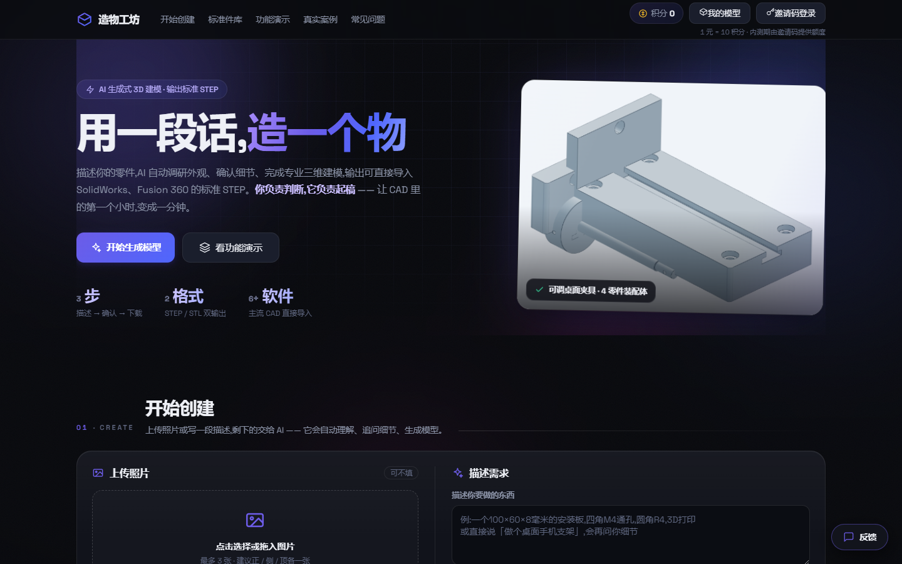
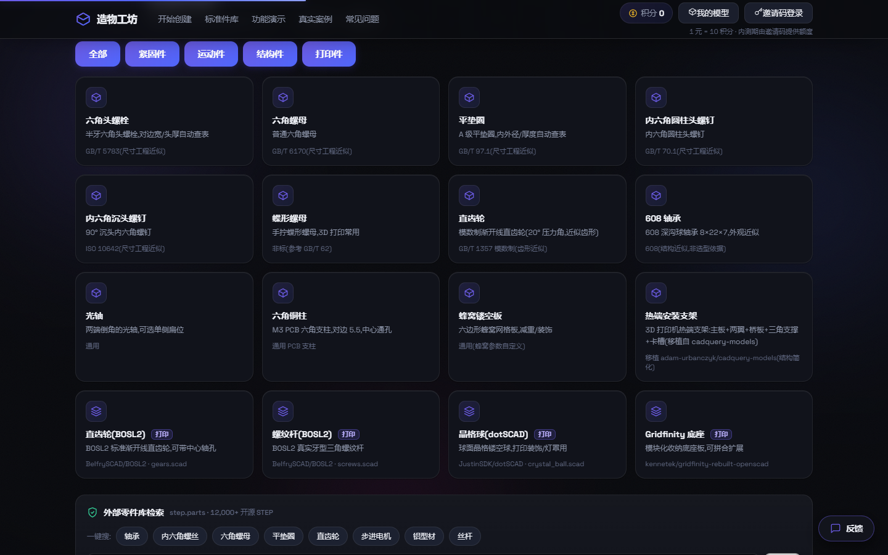
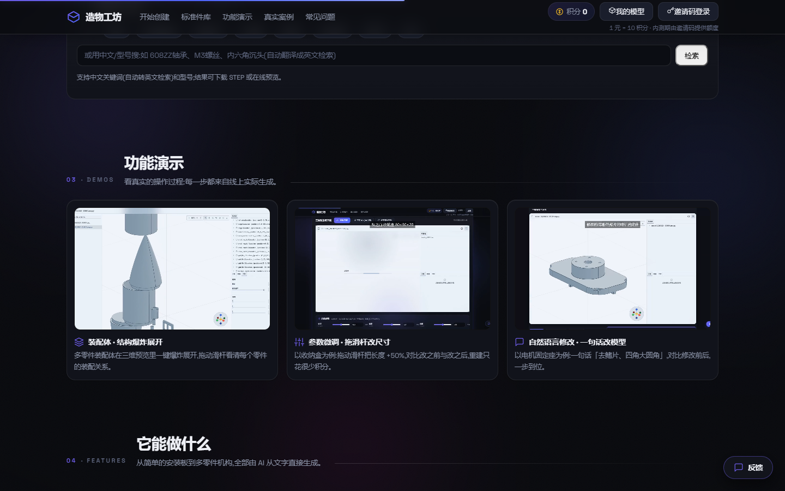

# 造物工坊 · Text2CAD

> 用一段话或一张照片,造一个可以制造的 3D 模型。

[](https://zaowugongfang.com)
[](LICENSE)
[](https://www.python.org/)
[](https://www.docker.com/)

造物工坊是一个 **AI 生成式 3D 建模产品**:输入文字描述或照片,系统自动调研外观、澄清细节、生成参数化建模代码,输出工业通用的 **STEP / STL** 文件,并提供在线三维预览、参数微调与自然语言修改。

**定位:** 零件级生成式设计工具 —— 让 CAD 里的第一个小时,变成一分钟。

---

## 目录

- [功能特性](#功能特性)
- [界面预览](#界面预览)
- [技术栈](#技术栈)
- [目录结构](#目录结构)
- [快速开始](#快速开始)
- [标准件库](#标准件库)
- [部署](#部署)
- [计费模型](#计费模型)
- [许可与致谢](#许可与致谢)
- [免责声明](#免责声明)

---

## 功能特性

### 核心生成管线
| 能力 | 说明 |
|---|---|
| 🖼️ 文/图生成 | 文字描述或 1~3 张照片 → 工程规格 → 澄清问答(推荐默认值,一键全选)→ 自纠错代码生成 → STEP/STL |
| 🎨 外观调研 | 生成前由模型内置知识整理造型规格书(不联网) |
| 🎚️ 参数微调 | 自动提取顶层尺寸常量,拖动滑杆本地重建(≈0 积分) |
| 💬 自然语言修改 | 在三维预览中点选零件,一句话改模型 |
| 🧩 装配体 | 多零件装配 + 结构树 + 爆炸展开 |

### 标准件库(零积分、免登录)
- **12 个 build123d 原生标准件**:六角螺栓/螺母/垫圈、内六角螺钉(圆柱头/沉头)、蝶形螺母、直齿轮、608 轴承、光轴、六角铜柱、蜂窝板、热端支架 —— 国标查表、秒出 STEP
- **4 个 OpenSCAD 打印件**:BOSL2 直齿轮/真实螺纹杆、dotSCAD 晶格球、Gridfinity 底座 —— 服务器端渲染 STL
- **step.parts 外部检索**:12,000+ 开源 STEP 件,支持中文检索(自动翻译)与一键搜

### 平台能力
- 积分计费(1 元 = 10 积分)、邀请码登录、管理后台
- 全局任务队列(并发可配)、心跳看门狗、每日备份与清理
- 三维预览器(WebGL,已汉化,支持 STEP/STL、爆炸展开、测量)

## 界面预览

| 首页 | 标准件库 | 功能演示 |
|---|---|---|
|  |  |  |

## 技术栈

- **后端**:Python 3.12 / Flask
- **几何内核**:build123d + cadquery-ocp(OpenCascade);OpenSCAD(打印件渲染)
- **大模型**:DeepSeek(代码生成/辅助)+ Moonshot Kimi(视觉理解)
- **前端**:单页原生 JS + 深色设计系统(构建源见 `redesign/`,由 `redesign/build.py` 组装)
- **三维预览**:自研 CAD Viewer(WebGL,源码见 `cad-viewer-src/`)
- **部署**:Docker Compose + nginx + Let's Encrypt

## 目录结构

```
web_app.py            # Flask 入口与全部接口
text2cad_proto.py     # 生成管线(精炼/理解/问答/代码/构建/参数提取)
library/              # 标准件库(build123d 零件 + OpenSCAD 目录)
web/                  # 前端(含构建产物 index.html 与静态资源)
redesign/             # 前端构建源(part1.html + extra.js + build.py)
cad-viewer-src/       # 三维预览器(汉化版源码)
billing.py            # 积分计费
users.py              # 账号与邀请码
pay.py                # 支付网关(mock/alipay/epay)
jobstore.py           # 任务持久化
make_zip.py           # 打包部署包
redeploy2.py          # 上传 + 重建容器(密码走环境变量 ZW_SERVER_PASS)
Dockerfile            # 生产镜像
docker-compose.yml    # 编排
nginx.conf            # 反代 + HTTPS
start.sh              # 容器启动(Web + 预览器)
```

## 快速开始

### 环境变量(参考 `.env.example`)

```bash
export DEEPSEEK_API_KEY="sk-..."     # 代码生成(必填)
export MOONSHOT_API_KEY="sk-..."     # 照片识别(可选,不用照片可留空)
export REQUIRE_AUTH="0"              # 本地调试关闭登录;生产为 1
```

### 本地运行

```bash
pip install -r requirements_server.txt
python -m playwright install --with-deps chromium   # 生成快照用
python web_app.py                                    # http://127.0.0.1:5000
```

前端改动后重新组装页面:

```bash
python redesign/build.py   # 由 redesign/part1.html + extra.js + 业务 JS 生成 web/index.html
```

### 测试

```bash
python library/smoke_test.py     # 构建全部标准件并导出 STEP(本地冒烟)
python billing_test.py           # 计费单元测试
```

## 标准件库

- 原生标准件定义于 `library/parts.py`(PartSpec 参数模型 + build123d 生成函数),国标查表在 `library/__init__.py`
- OpenSCAD 打印件目录在 `library/oscad_catalog.json`(模板 + 参数),渲染依赖镜像内克隆的 BOSL2 / dotSCAD / gridfinity(见 Dockerfile)
- 全部生成零积分、免登录;同参数自动命中缓存

## 部署

见 `部署说明.md` 与 `上线清单.md`。核心流程:

```bash
python make_zip.py            # 打包代码 + 前端 + 预览器
$env:ZW_SERVER_PASS="..."     # 服务器 root 密码(不写入任何文件)
python redeploy2.py           # 上传 → docker compose build → up(自动清理悬空镜像)
```

## 计费模型

- 1 元 = 10 积分;按实际 token 消耗折算(500 积分/百万 token)
- 简单件约 3~10 积分;参数微调为本地计算,几乎不花积分
- 允许欠费:余额可为负,下次充值时优先补欠款
- 内测期通过邀请码发放额度(每个邀请码自带 50 积分)

## 许可与致谢

- 本项目基于 [earthtojake/text-to-cad](https://github.com/earthtojake/text-to-cad)(MIT)演进而来
- 第三方组件许可详见 [THIRD_PARTY_NOTICES.md](THIRD_PARTY_NOTICES.md)
- 本项目代码以 [MIT License](LICENSE) 开源

## 免责声明

本产品定位为「零件级」生成式设计工具,输出适合原型验证、3D 打印与设计沟通;
公差、强度校核、模具设计等工业级环节需专业工程师复核。
